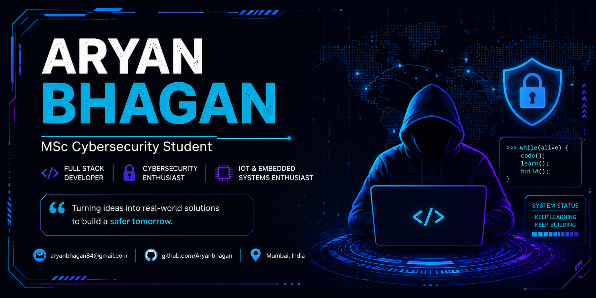

<div align="center">



<a href="https://github.com/Aryanbhagan">
  
  
</p>
</a>

<br/>


</div>

<br/>

## 🧠 About Me


```yaml
name: Aryan Bhagan
role: Programmer & Embedded Systems Enthusiast
focus: Real-world safety-tech and full-stack projects
currently_building: Drink & Drive Prevention System 🛞
learning: New frameworks, IoT protocols, cloud backends
fun_fact: I like turning "what if" ideas into working prototypes
```

- 🔭 Currently building safety-focused embedded systems
- 🌱 Exploring Python, C, and hardware-driven solutions
- 💬 Ask me about IoT, sensors, or Flutter apps
- 📫 Reach me at **aryanbhagan84@gmail.com**

<br/>

## 🛠️ Tech Stack

## 🛠️ Tech Stack

<p align="center">
  
</p>


## 🚀 Featured Projects

### 🛞 Drink & Drive Prevention System

An IoT-based vehicle safety system that detects alcohol consumption before ignition, prevents vehicle operation when necessary, and supports real-time alert capabilities using embedded systems, GPS, and GSM communication.

**Tech Stack**

`ESP32` `MQ-3` `GPS` `GSM` `Embedded C` `Arduino IDE`

<p>
<a href="https://github.com/Aryanbhagan/Drink-and-drive-prevention-system">

</a>
</p>

---

### 🏪 Shopkeeper App

A full-stack shop management application featuring inventory management, billing, employee attendance, authentication, and cloud-backed data storage for efficient business operations.

**Tech Stack**

`Flutter` `Node.js` `Express.js` `MongoDB` `Firebase`

<p>
<a href="https://github.com/Aryanbhagan/shopkeeper_app">

</a>

<a href="https://github.com/Aryanbhagan/shopkeeper_backend">

</a>
</p>

---

### 🚗 Car Rental App

A modern vehicle rental platform built with Angular and a Node.js backend, allowing users to browse vehicles, manage bookings, authenticate securely, and streamline rental management.

**Tech Stack**

`Angular` `Node.js` `Express.js` `MongoDB`

<p>
<a href="https://github.com/Aryanbhagan/car-rental-webapp-CRUD-based-">

</a>
</p>
<br/>

## 📊 Developement  Insights

<p align="center">
  

  
</p>

<p align="center">
  
</p>
<br/>

## 🐍 Contribution Snake

<div align="center">


<sub>⚙️ To activate this, add the <code>snk</code> GitHub Action (see setup note below the fold)</sub>

</div>

<br/>

## 🌐 Connect With Me

<div align="center">

<a href="mailto:aryanbhagan84@gmail.com">

</a>
<a href="https://www.linkedin.com/in/aryan-bhagan-98b12a323/">

</a>
<a href="https://github.com/Aryanbhagan">

</a>

</div>

<br/>

<div align="center">


**Thanks for stopping by — let's build something cool together! 😊**

</div>
